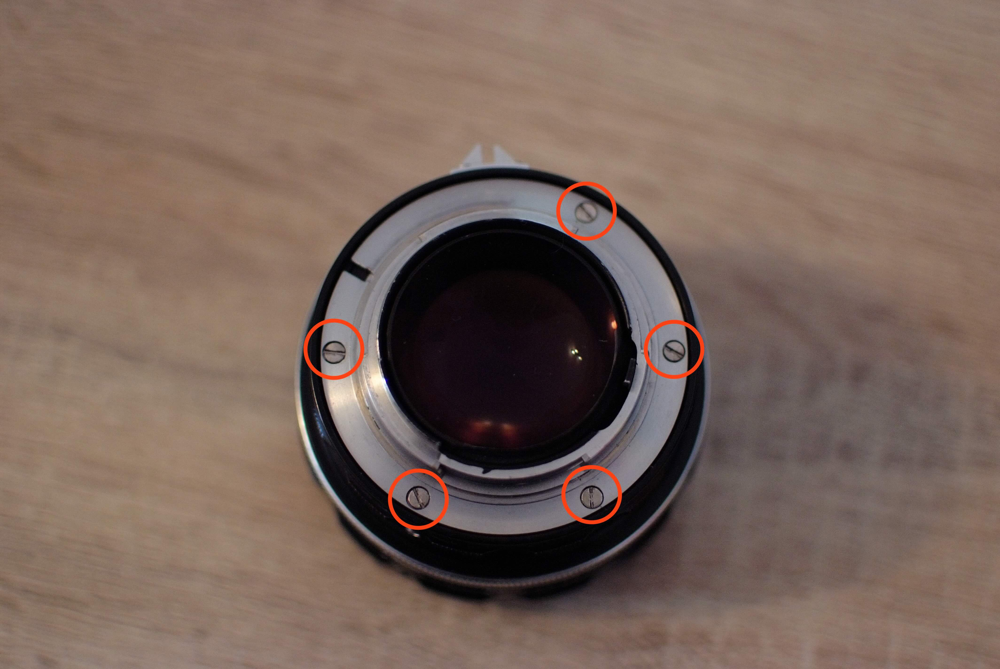
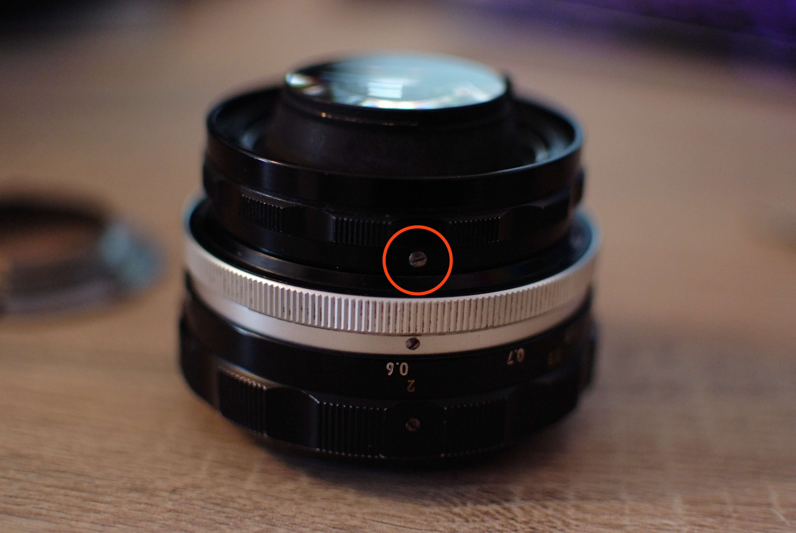
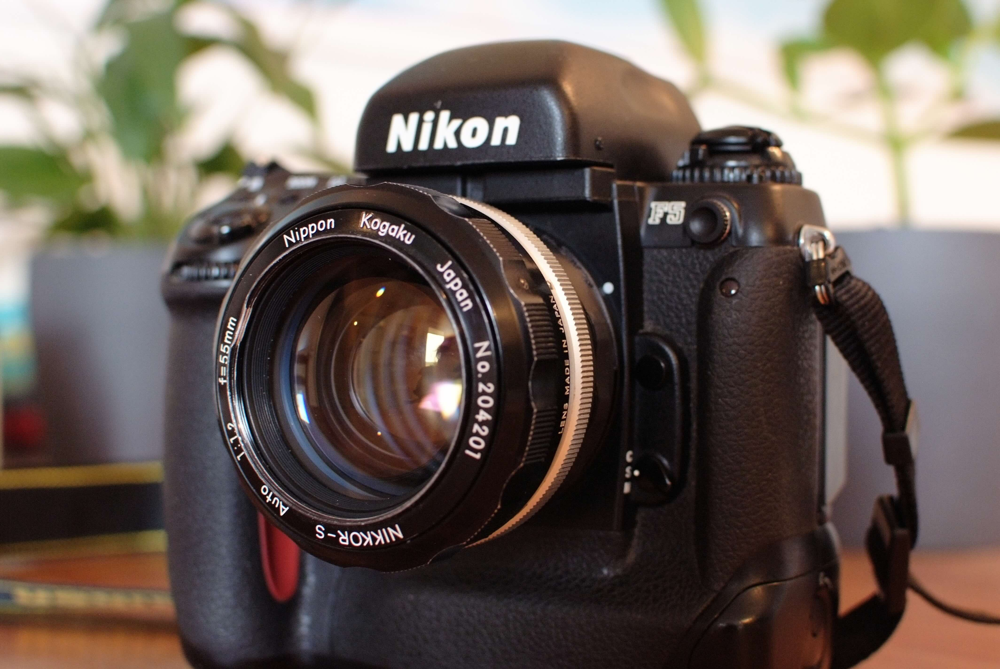

# Nikon 55mm f1.2 Auto AI Conversion

This part is meant as a replacement for the Nikon AI conversion kit part B number 9.
However, this design (mainly the grip) is much closer to the original non-AI aperture ring.

**WARNING!**
> All 55mm lenses are fully incompatible with at least the Nikon F4 and FA! This AI conversion does not change this fact! The 55mm lenses hit the maximum aperture lever that the Nikon F4 and FA use. You **will** damage your camera. Ask me how I know.
This incompatibility is documented within Nikon's camera manuals.
For later camera models (for example the Nikon F5) this AI conversion works fine because these cameras do not have the maximum aperture lever.

This part is specifically for the `Auto` version of this lens. I do not own a non-auto lens,
I therefore cannot determine if this part works on it or not.
It seems to use a different part number, so it is likely incompatible.
My information source about AI conversions: [http://www.photosynthesis.co.nz/nikon/aimod.html](http://www.photosynthesis.co.nz/nikon/aimod.html)

This modification does not alter the lens and is completely reversible.

## Printing

The provided STL is ready for print without further modifications, I printed using standard PLA
on a Neptune 4 3D printer and OrcaSlicer.

The aperture letters are small, on most if not all printers they will look ugly, if you don't want them
you can disable them in the provided SCAD source file.

There are also further customization options available in the OpenSCAD file:

- Prong holes for compatibility with Nikon F1/F2 meters
- Declicking for smooth aperture selection (ideal for video applications)
- Enable/Disable grip or grip rills
- Enable/Disable aperture letters (upper and lower separately)

## Installation

> [!WARNING]  
> Be careful with your screwdriver! Do not apply too much pressure, otherwise you might slip and scratch the lens!

The installation is quite easy on this lens.
I recommend to set the aperture to f1.2 before starting, it will make lining up the new aperture control ring later easier.

### Remove lens mount

Remove the 5 screws of the lens mount, grab the lens mount and put it aside:

### Remove aperture control screw

Remove the aperture control screw and remove the aperture control ring.
Store the ring somewhere safely if you want to reverse the modification.

### Insert new aperture control ring

Place your new aperture control ring onto the lens, ensure it is set to f1.2
Also ensure that the matching hole on the lens for the aperture control screw is lined up with the control ring hole.
Then screw in the aperture control screw. The hole in the new ring is intentionally smaller, you will need to forcefully
thread it.

### Re-attach lens mount

Place the lens mount on the lens, line up the screws and screw everything back together.

### Check and validate

You are now done! Check if you can control the aperture with the new aperture ring.
Then you can mount the lens on your camera. If set to f1.2 the aperture index should touch the camera
aperture feeler, but it should not move it.

